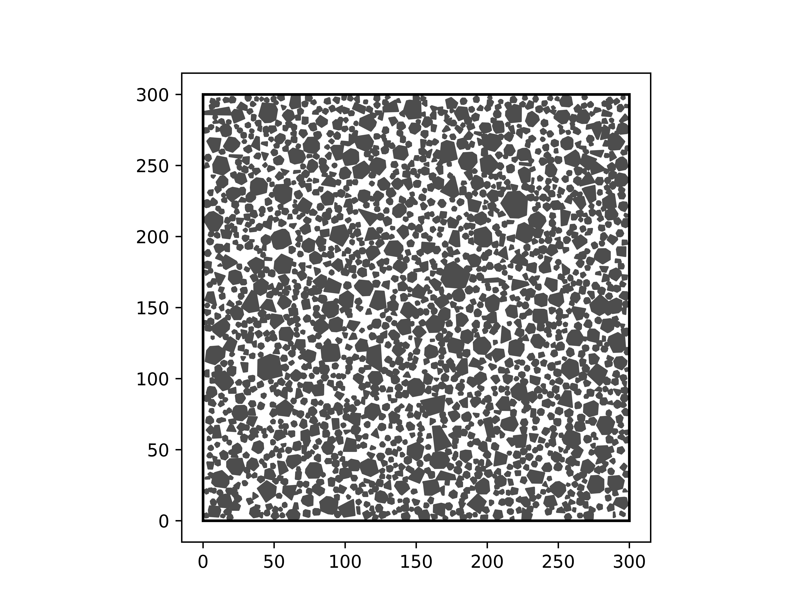

# random_particle_array_generator

A tool for generating random aggregate microstructures.

Written as part of my bachelor's thesis on the topic "Development of simple open code to create random particle arrays" at Aalto University. Descriptions of the methods and algorithms used are provided in the thesis.

Instructions and code are provided in the /src folder.

Feel free to email any questions to blobbeliblob@gmail.com

